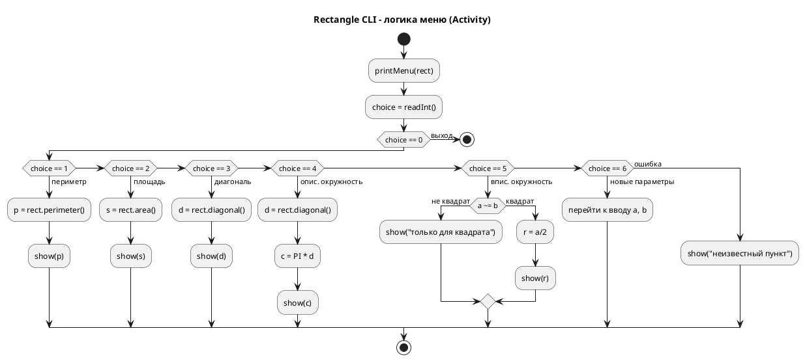

# 02-activity-menu

Исходник PlantUML: `02-activity-menu.puml`

```plantuml
@startuml
title Rectangle CLI - логика меню (Activity)

start
:printMenu(rect);
:choice = readInt();

if (choice == 0) then (выход)
  stop
endif

if (choice == 1) then (периметр)
  :p = rect.perimeter();
  :show(p);
elseif (choice == 2) then (площадь)
  :s = rect.area();
  :show(s);
elseif (choice == 3) then (диагональ)
  :d = rect.diagonal();
  :show(d);
elseif (choice == 4) then (опис. окружность)
  :d = rect.diagonal();
  :c = PI * d;
  :show(c);
elseif (choice == 5) then (впис. окружность)
  if (a ~= b) then (не квадрат)
    :show("только для квадрата");
  else (квадрат)
    :r = a/2;
    :show(r);
  endif
elseif (choice == 6) then (новые параметры)
  :перейти к вводу a, b;
else (ошибка)
  :show("неизвестный пункт");
endif

stop
@enduml
```
