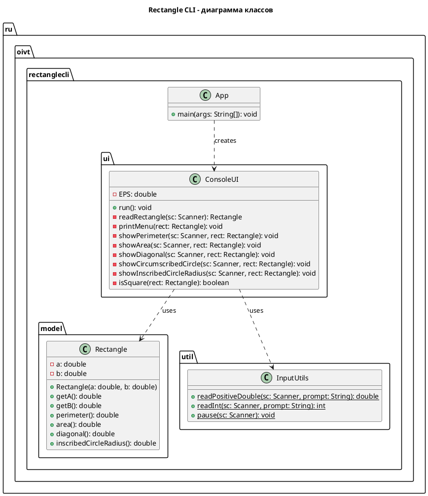

# 04-class

Исходник PlantUML: `04-class.puml`

```plantuml
@startuml
title Rectangle CLI - диаграмма классов

package "ru.oivt.rectanglecli" {
  class App {
    +main(args: String[]): void
  }
}

package "ru.oivt.rectanglecli.ui" {
  class ConsoleUI {
    -EPS: double
    +run(): void
    -readRectangle(sc: Scanner): Rectangle
    -printMenu(rect: Rectangle): void
    -showPerimeter(sc: Scanner, rect: Rectangle): void
    -showArea(sc: Scanner, rect: Rectangle): void
    -showDiagonal(sc: Scanner, rect: Rectangle): void
    -showCircumscribedCircle(sc: Scanner, rect: Rectangle): void
    -showInscribedCircleRadius(sc: Scanner, rect: Rectangle): void
    -isSquare(rect: Rectangle): boolean
  }
}

package "ru.oivt.rectanglecli.model" {
  class Rectangle {
    -a: double
    -b: double
    +Rectangle(a: double, b: double)
    +getA(): double
    +getB(): double
    +perimeter(): double
    +area(): double
    +diagonal(): double
    +inscribedCircleRadius(): double
  }
}

package "ru.oivt.rectanglecli.util" {
  class InputUtils {
    {static} +readPositiveDouble(sc: Scanner, prompt: String): double
    {static} +readInt(sc: Scanner, prompt: String): int
    {static} +pause(sc: Scanner): void
  }
}

App ..> ConsoleUI : creates
ConsoleUI ..> Rectangle : uses
ConsoleUI ..> InputUtils : uses

@enduml
```
