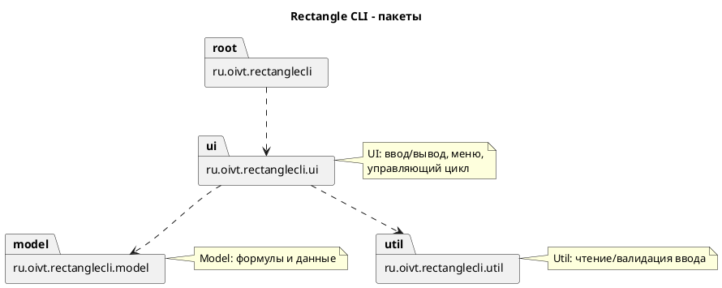

# 05-packages

Исходник PlantUML: `05-packages.puml`

```plantuml
@startuml
title Rectangle CLI - пакеты

package "ru.oivt.rectanglecli" as root
package "ru.oivt.rectanglecli.ui" as ui
package "ru.oivt.rectanglecli.model" as model
package "ru.oivt.rectanglecli.util" as util

root ..> ui
ui ..> model
ui ..> util

note right of ui
UI: ввод/вывод, меню,
управляющий цикл
end note

note right of model
Model: формулы и данные
end note

note right of util
Util: чтение/валидация ввода
end note

@enduml
```
